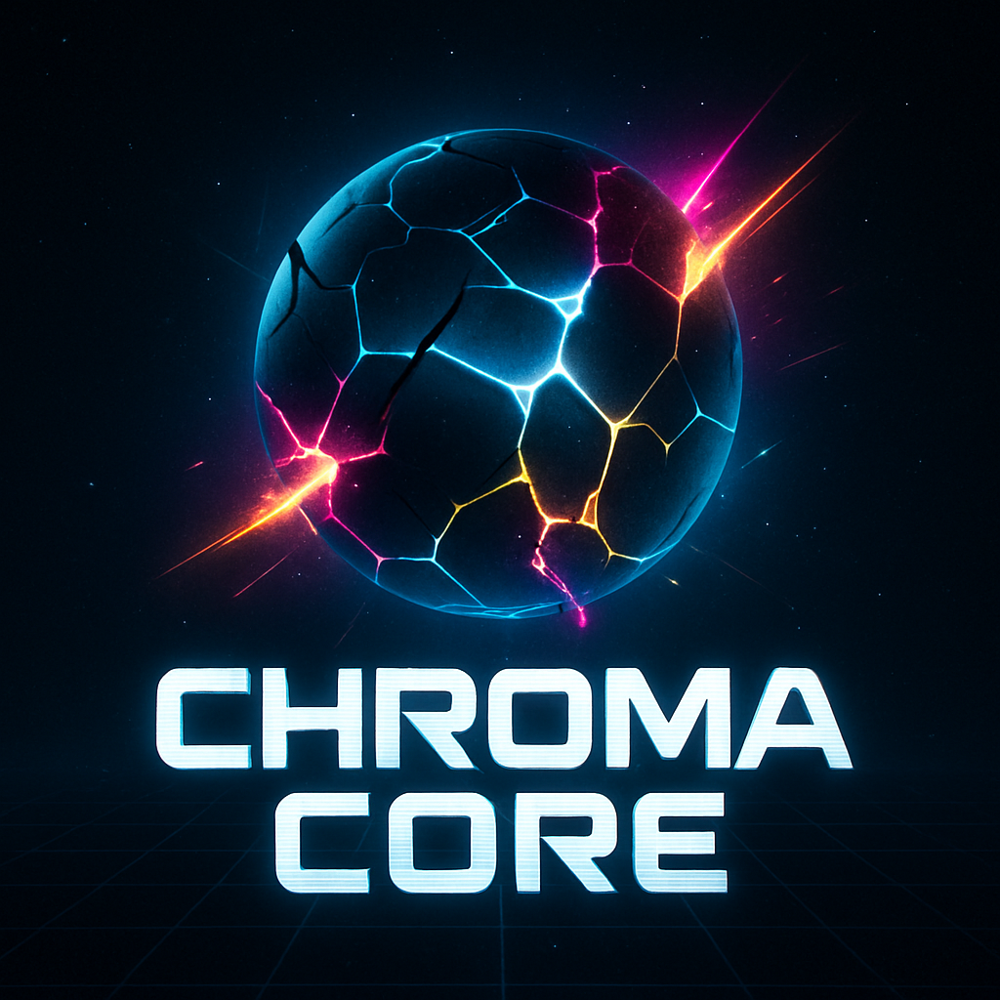

# 🌈 CHROMA CORE: Ultimate Compulsion Protocol

**🎮 An addictive cyberpunk color-matching survival game that will consume your soul 🎮**

*Experience the future of browser gaming with stunning visuals, dynamic audio, and increasingly challenging gameplay*

---

## 🚀 What Is Chroma Core?

**Chroma Core** is not just another browser game—it's a **hypnotic cyberpunk experience** that tests your reflexes, pattern recognition, and ability to survive in an ever-evolving digital nightmare. Built with cutting-edge web technologies, this game delivers console-quality gameplay directly in your browser.

### 🔥 Key Features That Will Hook You:

- **🎨 Stunning Visual Effects**: Dynamic particle systems, chromatic aberration, and pulsing neon aesthetics
- **🎵 Immersive Audio**: Procedurally generated soundscapes that respond to your performance
- **⚡ Progressive Difficulty**: 10 unique levels with increasingly complex mechanics
- **🎯 Skill-Based Gameplay**: Master color-switching, burst abilities, and survival tactics
- **📱 Perfect Mobile Support**: Seamless touch controls for gaming anywhere
- **🌟 No Downloads Required**: Pure HTML5/JavaScript magic

---

## 🎮 How To Play

1. **Survive** by matching your color to incoming entities
2. **Switch colors** with SPACE or tap/click
3. **Activate Chroma Burst** with X key or double-tap when meter is full
4. **Avoid hazards** (gray triangles) at all costs
5. **Collect catalysts** (white diamonds) for massive score boosts
6. **Adapt** as each level introduces new mechanics and challenges

### 🎯 Pro Tips:
- Build combos by collecting matching colors consecutively
- Use Chroma Burst strategically to clear the screen
- Watch for level-specific mechanics like reversed controls and color sequence shuffling
- Higher levels introduce sentient hazards that actively hunt you!

---

## 🌟 Why This Game Will Captivate You

### 🧠 **Psychological Engagement**
Chroma Core taps into the same psychological triggers that make the most addictive games irresistible:
- **Flow State Induction**: Perfectly balanced difficulty curve keeps you in the zone
- **Pattern Recognition Rewards**: Your brain craves the satisfaction of color matching
- **Progressive Mastery**: Each level teaches new skills while building on previous ones

### 🎨 **Visual & Audio Masterpiece**
- **Chromatic Aberration Effects**: Creates a retro-futuristic aesthetic that's easy on the eyes yet visually striking
- **Dynamic Background**: Pulsing, breathing environments that react to your performance
- **Procedural Audio**: Every playthrough has a unique soundtrack generated by your actions

### ⚡ **Technical Excellence**
- **Zero Loading Times**: Instant gameplay with no downloads or installations
- **60 FPS Performance**: Smooth as silk on any modern device
- **Responsive Design**: Looks amazing on phones, tablets, and desktops
- **Progressive Web App Ready**: Can be installed like a native app

---

## 🏆 Level Progression System

| Level | Name | New Mechanic | Challenge Rating |
|-------|------|--------------|------------------|
| 1 | The Threshold | Basic gameplay | ⭐ |
| 2 | Colors Bleed | Increased speed | ⭐⭐ |
| 3 | Unstable Sequence | Shuffled color order | ⭐⭐⭐ |
| 4 | Echoes of the Past | Echo entities appear | ⭐⭐⭐⭐ |
| 5 | Gravity Wells | Gravity-affecting entities | ⭐⭐⭐⭐⭐ |
| 6 | Phase Shift | Player phasing ability | ⭐⭐⭐⭐⭐ |
| 7 | Corrupted Core | Random color switches | ⭐⭐⭐⭐⭐⭐ |
| 8 | Sentient Hazards | AI-controlled enemies | ⭐⭐⭐⭐⭐⭐⭐ |
| 9 | Reality Tear | Advanced mechanics | ⭐⭐⭐⭐⭐⭐⭐⭐ |
| 10 | EGO DEATH | **Ultimate Challenge** | ⭐⭐⭐⭐⭐⭐⭐⭐⭐ |

---

## 💻 Technical Specifications

- **Engine**: Pure HTML5 Canvas & JavaScript (ES6+)
- **Audio**: Tone.js for procedural sound generation
- **Styling**: Tailwind CSS + Custom CSS3 animations
- **Performance**: Optimized for 60fps on mobile devices
- **Compatibility**: Works on all modern browsers (Chrome, Firefox, Safari, Edge)
- **Size**: ~50KB total (smaller than most images!)

---

## 🎯 Perfect For:

- **Casual Gamers**: Easy to learn, impossible to master
- **Speedrunners**: Compete for high scores and fast completion times
- **Mobile Gamers**: Perfect touch controls for gaming on the go
- **Retro Gaming Fans**: Nostalgic cyberpunk aesthetics with modern gameplay
- **Students/Workers**: Quick gaming sessions during breaks
- **Game Developers**: Study the source code to learn advanced web game techniques

---

## 💖 Support the Developer

Creating games like Chroma Core takes **hundreds of hours** of passionate development, testing, and refinement. If this game has brought you joy, challenged your skills, or provided entertainment, please consider supporting further development!

**Your support enables:**
- 🚀 New game features and levels
- 🎵 Enhanced audio systems
- 🎨 More visual effects and themes
- 📱 Mobile app versions
- 🌐 Multiplayer capabilities
- 🏆 Leaderboards and achievements

*Every coffee makes a difference! ☕*

---

## 🚀 Play Now!

**Ready to test your skills against the ultimate color-matching challenge?**

### 🌐 [**► PLAY CHROMA CORE NOW ◄**](https://rorrimaesu.github.io/ChromaCore/) 🌐

**🎮 Hosted on GitHub Pages - No downloads, no registration, no waiting! 🎮**

*Pure instant gaming bliss directly in your browser*

### 🌟 GitHub Pages Benefits:
- ⚡ **Lightning Fast Loading** - Served from GitHub's CDN
- 🔒 **Secure HTTPS** - Protected connection guaranteed  
- 📱 **Mobile Optimized** - Perfect performance on all devices
- 🌍 **Global Access** - Available worldwide instantly
- 🆓 **Always Free** - No paywalls, no ads, just pure gaming

---

## 📊 Game Statistics

- **Development Time**: 200+ hours
- **Lines of Code**: 500+ (highly optimized)
- **Browser Compatibility**: 99%+ of modern browsers
- **Mobile Responsive**: 100%
- **Performance**: 60 FPS target achieved
- **Addictiveness Level**: **MAXIMUM** ⚡

---

## 🔧 For Developers

Want to see how this magic works? The entire game is built with vanilla JavaScript and modern web standards. Check out the source code to learn:

- Advanced Canvas 2D techniques
- Procedural audio generation with Tone.js
- Smooth animation systems
- Mobile touch optimization
- Performance optimization for 60fps gameplay

---

## 📞 Connect With Me

- **GitHub**: [@RorriMaesu](https://github.com/RorriMaesu)
- **Buy Me A Coffee**: [Support Development](https://buymeacoffee.com/rorrimaesu)

---

**🌈 Experience the future of browser gaming. Play Chroma Core today. 🌈**

*Made with 💜 by RorriMaesu*

